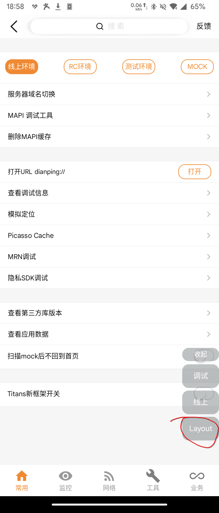

# Hook 美团大众点评的 Picasso 框架，制作大众点评爬虫

*解决不了的问题：大众点评每隔一段时间就会弹人机验证。*

*大众点评的页面会热更新，所以 Hook 代码也得跟着更新，但是我的老师开摆了所以我就不更新代码了。*

## 前言（要省流的直接跳过）

起因是我的某位老师想要拿大众点评的酒店信息训练 Agent 来做酒店推荐，然后叫我和 [NekoMoYi](https://github.com/NekoMoYi) 去爬大众点评。

一开始我们尝试了爬网页版，先是遇到了字体替换，然后又喜提账号风控。又尝试了对客户端和小程序抓包，但是大众点评不走 http 所以也抓不到。

反编译大众点评安卓客户端又查了一番资料后得知，大众点评用的是美团的 Picasso 图形框架，在安卓上类似于 ReactNative，也是 JS to Native 的框架，大众点评通过下发 JS 文件来热更新页面。

我手机上的大众点评版本有点老，手动修改了下发的 JS 文件它也不会主动重新获取 JS 文件。我们尝试了往 JS 文件里塞 `console.log`，但是这 JS 文件是已经编译成 Web Packet 那种形式的，改它就跟改汇编似的，所以这个办法还是 Pass 了。

## 大众点评的 Debug 面板

大众点评的安卓客户端没加壳，里面的类名方法名都一目了然。

我用 **创建快捷方式 (com.x7890.shortcutcreator)** *（用 Anywhere- (com.absinthe.anywhere_)* 也行） 看了一下它的 Activity 列表，里面有一个 **新工具面板 (com.dianping.debug.activity.NewDebugActivity)** ，打开之和能看到许多好玩的调试选项，但最重要的是侧边吸附的调试菜单里有一个 **Layout** 按钮，点一下之后会有一个 **选择View** 按钮。




这样，就可以在大众点评的页面里直接选中查看我们想要的组件：


点击 **视图层级** 还能查看整个页面的组件树：


相信你看到上图中的 `com.dianping.imagemanager.DPImageView` 和组件树中的类名已经知道该怎么做了。

## 编写 Lsposed 模块进行 Hook

*我当时的完整代码: [FuckLogan](https://github.com/MCredbear/FuckLogan) （为什么叫 FuckLogan：**新工具面板**里底栏监控选项卡点进去能看到个 Logan 日志上报，我们当时以为这个 Debug 面板叫 Logan）*

在编写 Hook 代码前，我们得先看一下大众点评的代码。

以`com.dianping.picasso.model.TextModel`这个类为例：
```java
//
// Decompiled by Jadx - 600ms
//
package com.dianping.picasso.model;

import android.text.TextUtils;
import com.dianping.jscore.model.ArchiveException;
import com.dianping.jscore.model.DecodingFactory;
import com.dianping.jscore.model.Unarchived;
import com.dianping.picasso.PicassoTextUtils;
import com.dianping.picasso.creator.PicassoBaselineInterface;
import com.dianping.picasso.creator.PicassoSizeToFitInterface;
import com.dianping.picasso.model.params.TextViewParams;
import com.google.gson.annotations.Expose;
import com.meituan.android.paladin.b;
import org.json.JSONObject;

public class TextModel extends PicassoModel implements PicassoSizeToFitInterface, PicassoBaselineInterface {
    public static final DecodingFactory<TextModel> PICASSO_DECODER;
    public boolean adjustsFitWidth;
    public boolean canShowQuickMenu;

    @Expose
    public int contentVerticalAlignment;
    public boolean disableBold;
    public Float firstLineHeadIndent;

    @Expose
    public int fontStyle;

    @Expose
    public int linespacing;
    public boolean needSizeToFit;

    @Expose
    public int padding;

    @Expose
    public int paddingBottom;

    @Expose
    public int paddingLeft;

    @Expose
    public int paddingRight;

    @Expose
    public int paddingTop;

    @Expose
    public boolean strikethrough;

    @Expose
    public int textAlignment;
    public String textEndColor;
    public int textOrientation;
    public float textShadowOffsetX;
    public float textShadowOffsetY;
    public float textShadowRadius;
    public String textStartColor;

    @Expose
    public boolean underline;

    @Expose
    public String text = "";

    @Expose
    public float textSize = 14.0f;

    @Expose
    public String textColor = "";

    @Expose
    public String fontName = "";

    @Expose
    public int lineBreakMode = 4;

    @Expose
    public int numberOfLines = 1;
    public String sizeKey = "";
    public String textShadowColor = "";

    static {
        b.a(-6182687182221348960L);
        PICASSO_DECODER = new TextModel$1();
    }

    protected void readExtraProperty(int i, Unarchived unarchived) throws ArchiveException {
        switch (i) {
            case 6175:
                this.needSizeToFit = unarchived.readBoolean();
                return;
            case 6288:
                this.firstLineHeadIndent = Float.valueOf((float) unarchived.readDouble());
                return;
            case 6607:
                this.linespacing = (int) unarchived.readDouble();
                return;
            case 7565:
                this.disableBold = unarchived.readBoolean();
                return;
            case 9343:
                this.canShowQuickMenu = unarchived.readBoolean();
                return;
            case 11830:
                this.textColor = unarchived.readString();
                return;
            case 13205:
                this.textEndColor = unarchived.readString();
                return;
            case 13614:
                this.textStartColor = unarchived.readString();
                return;
            case 15054:
                float readDouble = (float) unarchived.readDouble();
                if (readDouble <= 1.0E-8d) {
                    readDouble = 14.0f;
                }
                this.textSize = readDouble;
                return;
            case 15226:
                this.fontName = unarchived.readString();
                return;
            case 15377:
                this.padding = (int) unarchived.readDouble();
                return;
            case 17592:
                this.textShadowOffsetX = (float) unarchived.readDouble();
                return;
            case 17593:
                this.textShadowOffsetY = (float) unarchived.readDouble();
                return;
            case 17709:
                this.text = unarchived.readString();
                return;
            case 18308:
                this.paddingTop = (int) unarchived.readDouble();
                return;
            case 19043:
                this.textOrientation = (int) unarchived.readDouble();
                return;
            case 30859:
                this.paddingRight = (int) unarchived.readDouble();
                return;
            case 31394:
                this.fontStyle = (int) unarchived.readDouble();
                return;
            case 32467:
                this.strikethrough = unarchived.readBoolean();
                return;
            case 34783:
                int readDouble2 = (int) unarchived.readDouble();
                if (readDouble2 <= 0) {
                    readDouble2 = Integer.MAX_VALUE;
                }
                this.numberOfLines = readDouble2;
                return;
            case 37294:
                this.lineBreakMode = (int) unarchived.readDouble();
                return;
            case 44825:
                this.adjustsFitWidth = unarchived.readBoolean();
                return;
            case 45468:
                this.paddingBottom = (int) unarchived.readDouble();
                return;
            case 47007:
                this.textShadowRadius = (float) unarchived.readDouble();
                return;
            case 47774:
                this.sizeKey = unarchived.readString();
                return;
            case 50892:
                this.underline = unarchived.readBoolean();
                return;
            case 52116:
                this.contentVerticalAlignment = (int) unarchived.readDouble();
                return;
            case 52918:
                this.textShadowColor = unarchived.readString();
                return;
            case 57272:
                this.paddingLeft = (int) unarchived.readDouble();
                return;
            case 65334:
                this.textAlignment = (int) unarchived.readDouble();
                return;
            default:
                super.readExtraProperty(i, unarchived);
                return;
        }
    }

    public void switchModel() {
        if (this.viewParams == null) {
            this.viewParams = new TextViewParams();
        }
        this.viewParams.switchModel(this);
    }

    public boolean needSizeToFit() {
        return this.needSizeToFit;
    }

    public String sizeKey() {
        String str;
        if (!TextUtils.isEmpty(this.sizeKey)) {
            return this.sizeKey;
        }
        StringBuilder sb = new StringBuilder();
        sb.append(this.text);
        sb.append("#");
        sb.append(this.numberOfLines);
        sb.append("#");
        sb.append(this.textSize);
        sb.append("#");
        sb.append(this.fontStyle);
        sb.append("#");
        sb.append(this.fontName);
        sb.append("#");
        sb.append(this.strikethrough);
        sb.append("#");
        sb.append(this.underline);
        sb.append("#");
        sb.append(this.linespacing);
        if (this.numberOfLines == 1) {
            str = "";
        } else {
            str = "#" + this.width;
        }
        sb.append(str);
        return sb.toString();
    }

    public JSONObject calculateSize() {
        return PicassoTextUtils.sizeToFit(this);
    }

    public float baseLineWithWidth(float f, float f2) {
        return this.numberOfLines >= 2 ? f2 : PicassoTextUtils.getBaseline(this);
    }
}

```

可以看它的属性初始化基本都是在`readExtraProperty`这个方法里完成的，如果需要获取它的`text`属性，可以 hook 它的 `readExtraProperty`方法，在这个方法执行后判断参数`i`是否为`17709`，如果是则获取它的`text`属性。

其它的组件类也都有`readExtraProperty`这个方法，提取属性的办法也大差不差。

当然我们不可能每个组件都提取，我们可以根据组件之间的布局关系来判断我们要提取的组件是哪个。

举个例子，假设我们要提取某个页面下的用户评论，而展示用户评论的组件的布局是这样的：
```
GroupModel （横向）
├── ImageModel （用户头像）
└── GroupModel （竖向）
       ├── TextModel （用户名）
       ├── TextModel （评论内容）
       └── TextModel （评论日期）
```

*`GroupModel`的作用差不多是 Column 或 Row，它有一个`subviews`属性用于存储子组件*

如果某个`GroupModel`有`ImageModel`和`GroupModel`这两个子组件，且子组件中的`GroupModel`有3个`TextModel`，则说明第2个`TextModel`是我们要提取的用户评论。

具体的 Hook 代码请查看[FuckLogan](https://github.com/MCredbear/FuckLogan)

*顺带一提，从反编译出的代码上看，Picasso 的 ListModel 每次往底部添加新元素都要重构一遍一整个 list，也不知道这种代码能正常运行是 Art 虚拟机优化太好了还是处理器性能太好了还是反编译出的代码不对:D*